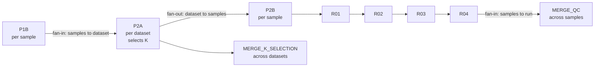

# mben-density-nf

[](https://github.com/sSanxiao/mben-density-nf/actions/workflows/ci.yml)

A Nextflow reimplementation of the cell-density-coupled gene signature analysis from my
MSc thesis (spatial transcriptomics, medulloblastoma), rebuilt so the results are
reproducible outside the machine they were first produced on.

*A Chinese-language version of this document, with additional commentary, is available at
[README.zh.md](README.zh.md).*

## What the workflow does



The structure is fan-out → fan-in → fan-out. Each sample runs
`P1B → P2B → R01 → R02 → R03 → R04` independently; `P2A` aggregates at the dataset level to
select K; QC tables and K-selection tables are then merged. Three execution profiles
(`standard`, `docker`, `test`) are provided; the trade-offs between them are set out in
`docs/NEXTFLOW_NOTES.md` §3.

## Running it

```bash
nextflow run main.nf -profile test,docker   # fastest entry point: 3 samples / 27 tasks / containerised
nextflow run main.nf -profile docker        # full run, containerised
nextflow run main.nf -profile standard      # full run, no containers (server)
```

The `docker` profile pulls two GHCR images under immutable tags
(`thesis-python:3.7.10-*` and `thesis-r:4.2.0-*`). The `standard` profile requires no
container runtime, and is the only option on the analysis server, where Docker 1.13.1 is
installed but the user has no daemon privileges.

## How reproducibility is established

**Environment is locked.** R dependencies are fully pinned in `env/renv.lock` (145 packages,
counted by parsing the `Packages` key as JSON rather than by string matching), Python
dependencies in `env/requirements.txt` (7 packages). Base images pin both the version tag and
the RSPM snapshot date, and both images carry provenance `LABEL`s, with the R image also
writing a `build_info.txt`. Images are built in CI rather than locally: an image built on one
developer's machine is not evidence of reproducibility.

**Equivalence is defined at two levels.** Bit-level and floating-point equivalence are
different claims and are held to different standards:

| Comparison | Standard applied | Result |
|---|---|---|
| Before vs after refactor, same machine | Content fingerprints **byte-identical** | Acceptance items A–F **6/6 pass** on the server (CentOS 7 / R 4.2.0 / Seurat 5.2.1). Donor2 is excluded at the R stage for a documented reason (see `docs/`) |
| Nextflow vs direct invocation, same container | Value-identical | **63 files exact match, numeric delta = 0** |
| Container vs native, across BLAS implementations | Numerical tolerance (\|Δρ\| < 1e-6; counts exact; gene sets and classification labels identical) | Gene sets and labels fully consistent |

**Fingerprints account for what cannot be compared directly.** `.rds` files embed timestamps,
so raw bytes are not comparable. Volatile columns (runtime, file size) are explicitly excluded
and the exclusion set is itself auditable. Column types are determined from content rather than
inferred by the reader, because `pandas` and `data.table::fread` disagree on all-`NA` columns.

**`-resume` works, and is demonstrated rather than asserted.** Adding a single comment line to
`R03` leaves 25 of 35 tasks cached; only `R03×4`, `R04×4` and `MERGE_QC×2` are recomputed.

## What CI actually caught

Five defects surfaced during development. All five were syntactically and logically correct
code; each was only exposed by executing the pipeline end to end.

| # | Class | Detail |
|---|---|---|
| 1 | File lifecycle | After splitting image layers, `rm -rf /tmp/*` removed a lockfile that had to survive across layers |
| 2 | API semantics | `install.packages(version=)` takes no such argument; it was silently absorbed by `...`, so the version pin never applied |
| 3 | Type semantics | `packageVersion()` returns a version object; comparing it as a string made `1.6.4` ≠ `1.6-4` |
| 4 | Cross-language constant drift | The constant mirror in `fingerprint.R` had fallen out of sync with `qc_schema.py`; the check was never reached locally because the wrong verification entry point was being used |
| 5 | Pipeline edge case | `sed` stripping version numbers did not filter comment lines, so `pip` received `#` as a package name |

**Negative control.** One letter of an `R03` output filename was deliberately corrupted to
confirm that CI turns red. The defect is a silent one: the R script exits 0 and prints a
complete, normal-looking summary, and it is Nextflow's output contract that catches it. A CI
pipeline that is always green is equivalent to no CI, so it has to be shown failing when it
should fail.

**Limit of the current setup.** Root-cause localisation still depends on reading job logs.
`upload-artifact` does not match dot-prefixed files by default, so `.nextflow.log` and
`.command.err` are not in the uploaded artifacts; the claim that a failure can be diagnosed
from artifacts alone does not currently hold. This is tracked below.

## Known limitations

- **The server can only use the `standard` profile.** Docker 1.13.1 without daemon
  privileges, and no apptainer available. This is a real HPC constraint, and it is why the
  workflow supports both containerised and non-containerised execution rather than assuming
  containers are available.
- **Python 3.7 is end-of-life, and that is deliberate.** Reproducing the thesis means
  reproducing the environment it ran in; re-running on current versions and calling the result
  a reproduction would be the larger problem.
- **`hdf5r` is not in `renv.lock`.** It is a Seurat `Suggests` dependency and was not captured
  by `snapshot()`, so its version is fixed only indirectly, via the RSPM snapshot date. This is
  a known gap in the environment lock.
- **`R05`–`R09` are not yet part of the Nextflow workflow.** Donor2 is excluded at the R stage
  because of a latent defect in the code under test, and `P1c` necessarily fails on a
  single-dataset fixture.
- **`row_order_md5` is not implemented.** Fingerprints sort by key, so physical row order is
  invisible to them, while `R03` output is ordered by absolute correlation coefficient. That
  ordering is meaningful but currently unchecked.

## Documentation

| Document | Question it answers |
|---|---|
| `docs/NEXTFLOW_NOTES.md` | Design notes: profile trade-offs, path coupling, `-resume`, engineering decisions (the most substantial single document) |
| `docs/P2_CONTAINER_VERIFICATION.md` | Numerical equivalence between container and native execution (fingerprints, tolerances, C5/C6 conclusions) |
| `docs/P4_REPORT.md` | The six CI acceptance items (S–X) and the five defects CI caught |
| `docs/REFACTOR_REPORT_qoder.md` | Refactor summary |
| `docs/IO_CONTRACT_CHECKLIST.md`, `docs/S5a_REPORT.md`, `docs/S5b_REPORT.md` | Process records from the refactor |
| `env/ENVIRONMENT.md` | Full tool and dependency versions (R and Python) |

Archive of the original thesis code: https://github.com/sSanxiao/Thesis_project

## Open items

| # | Item | Type | Note |
|---|---|---|---|
| 1 | Fix artifact upload (`include-hidden-files`) and repeat the negative control | Enhancement | `.nextflow.log` with `if-no-files-found: error`; `.command.err` / `.command.out` with `include-hidden-files: true`. The negative control must then be rerun, or the fix is itself unverified |
| 2 | Same-machine container comparison on the server | Blocked | No usable container runtime on the server; requires an administrator to install apptainer, or docker-group access |
| 3 | `row_order_md5` fingerprint extension | Enhancement | See known limitations above |
| 4 | Add `set.seed(42)` to `R01`–`R09` and make `R02 seed.use` explicit | Enhancement | Touches the code under test, so it is a decision at the thesis-code level. Note that C6 showed seeding does not resolve the `R02 n_clusters` difference, which originates in BLAS and is amplified deterministically |
| 5 | Unexplained recomputation of Mouse-side `R03`/`R04` in test A | Enhancement | `R02` was cached and inputs unchanged, yet downstream recomputed. Recorded as unexplained rather than rationalised; needs a clean baseline rerun to confirm |
| 6 | `-resume` unstable under the `docker` profile | Won't fix | Containerised task hashes change between runs. Not worth pursuing: the server can only run `standard`, and CI starts from a clean environment where resume does not apply |
